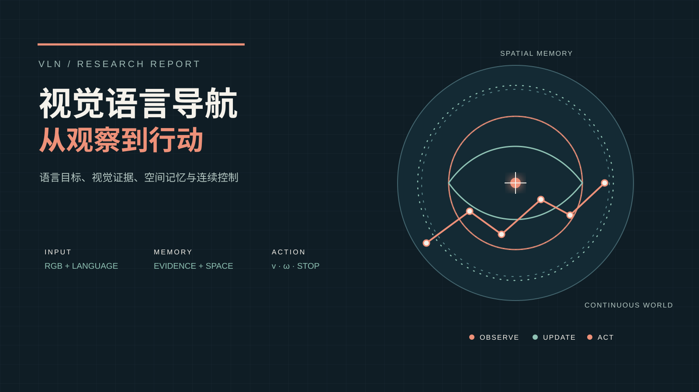
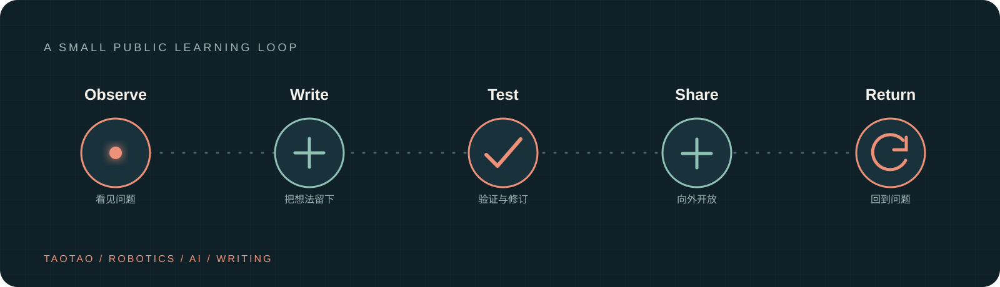

# τaotao's blog

一个记录机器人、AI 与学习实践的公开笔记空间。

<p align="center">
  
</p>

<p align="center"><em>从研究问题，到可复现的文章与实验记录。</em></p>

<p align="center">
  
</p>

## 本地运行

技术栈：React、Vite、Tailwind CSS 4，以及 `src/components/ui/` 中的 shadcn/ui 基础组件。

```bash
npm install
npm run dev
```

其他命令：`npm run lint` 检查代码，`npm run build` 生成生产构建，`npm run preview` 预览构建结果。

## 内容入口

- 技术文章：`src/content/articles/*.article.md`，编写方式见下方文章指南。
- IELTS 学习区：`/ielts`；资源配置位于 `src/content/ielts/data.js`，学习笔记位于 `src/content/ielts/notes/*.md`（YAML 元数据与 Markdown 正文）。
- About：`/about`，内容位于 `src/content/about-me.md`。

## 文档导航

| 文档 | 职责 |
| --- | --- |
| [项目说明](PROJECT.md) | 产品目标、范围、稳定原则与待决事项 |
| [文章编写与编辑指南](src/content/articles/README.md) | 文件格式、媒体、引用、预览与 AI 编辑边界 |
| [Git 速查](GIT_WORKFLOW.md) | 分支、提交、检查、合并与恢复 |
| [第三方声明](THIRD_PARTY_NOTICES.md) | 项目来源、字体与素材归属 |
