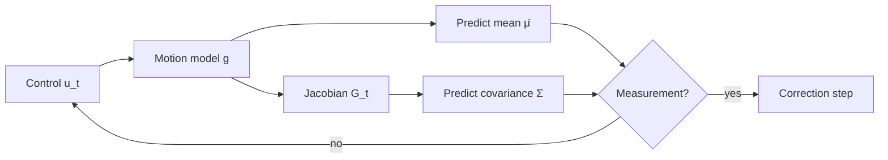

This post walks through the **prediction step** of EKF-SLAM: how we push the
robot's belief forward in time through a motion model, and how the covariance
grows as a result. It's a good stress test for a technical blog — it needs
equations, a code block, and a diagram of the filter loop.

## The pipeline

Every EKF-SLAM iteration alternates between *predict* (move) and *update*
(observe). The prediction step is the part we care about here:



## The state

We track the robot pose together with the map of $N$ landmarks in a single
state vector:

$$
\mathbf{x}_t = \begin{bmatrix} x & y & \theta & m_{1,x} & m_{1,y} & \cdots & m_{N,x} & m_{N,y} \end{bmatrix}^\top
$$

Only the pose block $(x, y, \theta)$ changes during prediction — landmarks are
static — which is what makes the Jacobian sparse.

## Motion model

With a velocity command $u_t = (v, \omega)$ over interval $\Delta t$, the
nonlinear motion model $g(u_t, \mathbf{x}_{t-1})$ advances the pose by:

$$
\begin{bmatrix} x' \\ y' \\ \theta' \end{bmatrix} =
\begin{bmatrix} x \\ y \\ \theta \end{bmatrix} +
\begin{bmatrix}
-\frac{v}{\omega}\sin\theta + \frac{v}{\omega}\sin(\theta + \omega\,\Delta t) \\[4pt]
\frac{v}{\omega}\cos\theta - \frac{v}{\omega}\cos(\theta + \omega\,\Delta t) \\[4pt]
\omega\,\Delta t
\end{bmatrix}
$$

The mean prediction is simply $\bar{\mu}_t = g(u_t, \mu_{t-1})$. The covariance
needs the Jacobian $G_t = \partial g / \partial \mathbf{x}$, and then:

$$
\bar{\Sigma}_t = G_t\,\Sigma_{t-1}\,G_t^\top + R_t
$$

where $R_t$ is the process noise. Note the inline form $G_t \Sigma G_t^\top$
mixes pose uncertainty into the landmark blocks — that coupling is the whole
point of SLAM.

## Code

Here is the prediction step in NumPy. The highlighted lines are where the
Jacobian's off-diagonal pose terms get written — the part that's easy to get
wrong:

```python title="ekf_slam.py" {14-16}
import numpy as np

def predict(mu, Sigma, u, dt, R):
    """EKF-SLAM prediction. mu: (3+2N,), Sigma: (3+2N, 3+2N)."""
    v, w = u
    theta = mu[2]

    # Mean: advance only the pose block (landmarks are static).
    if abs(w) < 1e-6:                      # straight-line limit
        dx = np.array([v * dt * np.cos(theta),
                       v * dt * np.sin(theta),
                       0.0])
    else:
        r = v / w
        dx = np.array([-r * np.sin(theta) + r * np.sin(theta + w * dt),
                        r * np.cos(theta) - r * np.cos(theta + w * dt),
                        w * dt])
    mu = mu.copy()
    mu[:3] += dx

    # Jacobian G = I + dg/dx, sparse outside the pose block.
    G = np.eye(len(mu))
    if abs(w) >= 1e-6:
        r = v / w
        G[0, 2] = -r * np.cos(theta) + r * np.cos(theta + w * dt)
        G[1, 2] = -r * np.sin(theta) + r * np.sin(theta + w * dt)

    Sigma = G @ Sigma @ G.T
    Sigma[:3, :3] += R                     # process noise on the pose only
    return mu, Sigma
```

## Takeaways

- The mean update touches only the pose; the covariance update touches
  **everything**, because $G_t \Sigma_{t-1} G_t^\top$ spreads pose uncertainty
  into every landmark correlation.
- Keep an eye on the $\omega \to 0$ singularity in $v/\omega$ — handle the
  straight-line case explicitly, as above.
- If this renders — equation, highlighted code, and the flowchart — the blog's
  whole presentation pipeline is working.
